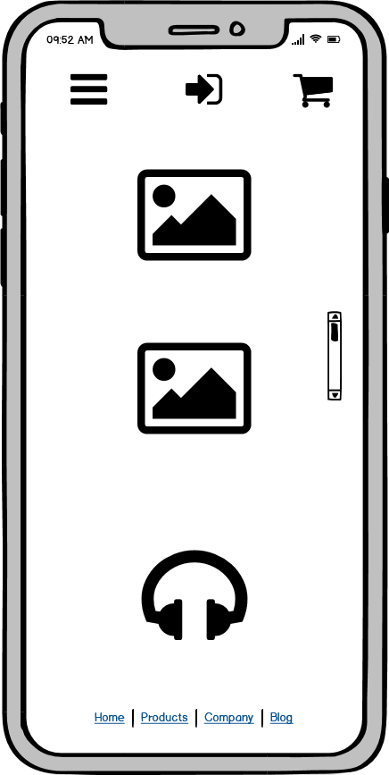
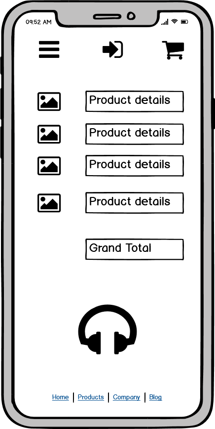
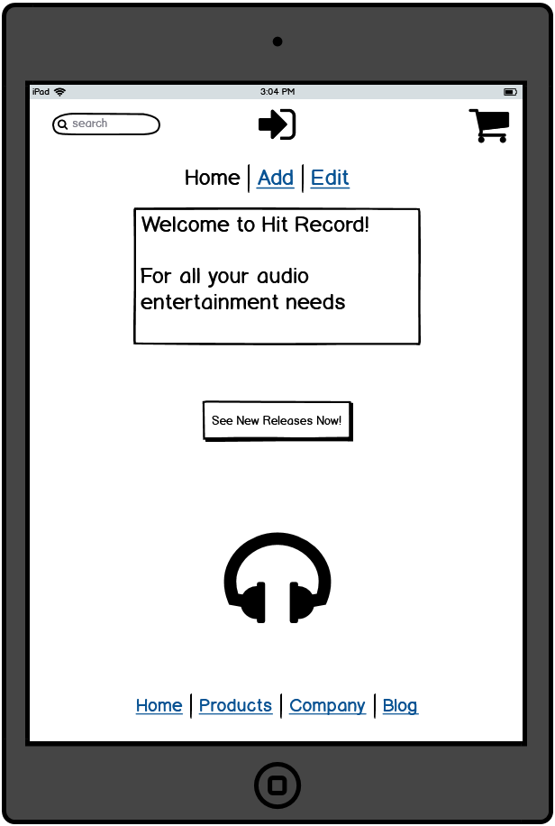
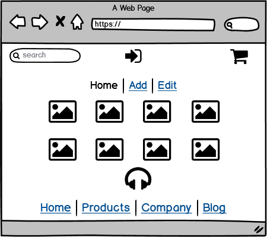
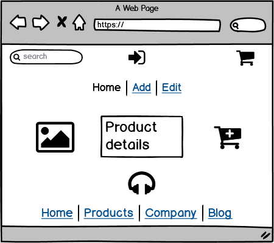
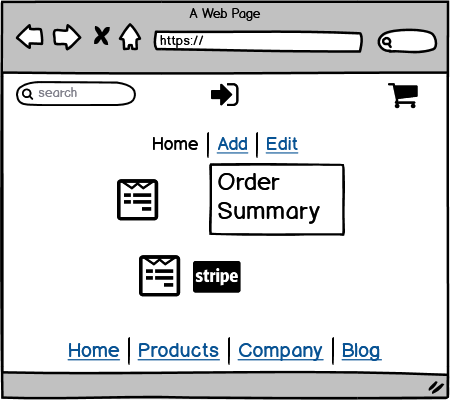

# **Denis Lymer Milestone Project 4**
## **Code Institute - Full Stack Frameworks With Django Module**
### **Django Full-Stack Project - 'Hit Record'**
#### "Welcome to Hit Record! The one-stop shop for all your music needs - tunes, tables, tees & more..."

I wanted to apply some of my working life experience and passions into my Milestone 4 project.
Previously I have worked in a record store, been an audio engineer, a DJ and a professional musician
amongst other things. I decided to create an online store combining some of these passions.
I wanted it to sell music in various formats (vinyl, CD, digital etc..), the means to play and listen
to the music (turntables, cd players, headphones and accessories) and merchandise items like hats and tshirts
of artists and bands. I wanted it to be bright, streamlined and easy to navigate for users. And I wanted it to
be intuitive for admins with easy to use CRUD functionality behind the scenes.

I settled on calling it 'Hit Record' as it can have two meanings, both relevant to what I was trying to achieve.
a Hit Record can be a well-selling album or single by a musical artist, and Hit Record can also refer to the 
ability of hardware to record or dub audio by pressing or clicking the Record button. I felt this title neatly
encapsulated the philosophy of the project.

## **Link to the website**

https://hit-record.herokuapp.com/

## **Link to the github repository**

https://github.com/menacethedenis/CI_Milestone_4_Denis_Lymer

## **Table of Contents**
1. [**UX**](#ux)
    - [**User Stories**](#user-stories)
    - [**Wire Frames**](#wire-frames)

2. [**Features**](#features)
    - [**Existing Features**](#existing-features)
    - [**Home page**](#home-page)
    - [**Products page**](#products-page)
    - [**Product Details page**](#product-details-page)
    - [**Shopping Bag page**](#shopping-bag-page)
    - [**Secure Checkout page**](#secure-checkout-page)
    - [**User Registration page**](#user-registration-page)
    - [**Features Left to Implement**](#features-left-to-implement)

3. [**Design and Styling**](#design-and-styling)

4. [**Testing**](#testing)

5. [**Known Bugs**](#known-bugs)

6. [**Technologies Used**](#technologies-used)

7. [**Deployment**](#deployment)
    - [**Heroku Deployment**](#heroku-deployment)
    - [**Local Deployment**](#local-deployment)

8. [**Credits**](#credits)
    - [**Content**](#content)
    - [**Acknowledgements**](#acknowledgements)

# **UX**

I did a lot of research before beginning to code this project. I viewed and explored many online stores 
that specialized in the products I wanted to sell on my own site. I kept note of my favourite aspects and 
elements of these sites before deciding on what direction to take my own UX and writing my User Stories.

### **User Stories**

I wrote the following user/admin stories to guide the project development:

#### **User**
* 1. As a user I want to be able to purchase my favourite music in various formats.
* 2. As a user I want to see new releases I may not be aware of.
* 3. As a user I want to be able to edit or delete items or quantities in a shopping bag.
* 4. As a user I want to be able to save my user profile for ease of purchase in the future.
* 5. As a user I want a secure checkout experience.
* 6. As a user I want an easy to navigate site.
* 7. As a user I want a good experience on different device sizes.
* 8. As a user I want to see more info/details about a product if I want them.
* 9. As a user I want to be able to see my previous order history.
* 10. As a user I want to be able to edit or update my user settings and address information.
* 11. As a user I want to be able to browse and/or purchase without having to register or save my personal details.
* 12. As a user I want to easily view a running subtotal of my purchases.
* 13. As a user I want to know if I qualify for free delivery or how much I need to spend to do so.
* 14. As a user I want to be able to login/logout of my account easily.

#### **Admin**
* 15. As an admin I want to be able to login from anywhere on the site.
* 16. As an admin I want to be able to edit or delete items from the site.
* 17. As an admin I want to be able to add new items to the site easily.
* 18. As an admin I want to change the categories of products like New Arrivals or Clearance.
* 19. As an admin I want to be able to view the registered site users.
* 20. As an admin I want to be able to add, edit or delete other users.


### **Wire frames**

The Balsamiq desktop app was used to draw up the wireframes for my website.
I focused on mobile first design, then tablet and larger desktop layouts.

<details>
<summary>Mobile views (Click for images)</summary>

<p align="center">


</p>

<p align="center">


</p>

<p align="center">


</p>

<p align="center">


</p>

<p align="center">


</p>
</details>

<details>
<summary>Tablet views (Click for images)</summary>

<p align="center">


</p>

<p align="center">


</p>

<p align="center">


</p>

<p align="center">


</p>

<p align="center">


</p>
</details>

<details>
<summary>Desktop views (Click for images)</summary>

<p align="center">


</p>

<p align="center">


</p>

<p align="center">


</p>

<p align="center">


</p>

<p align="center">


</p>
</details>

# **Features**

## **Existing Features**

### **Home page**

* Feature 1: Header - The header section of the site contains a search bar on the top left, the title of the site in the middle
 and the login and shopping cart icons. Any search returns the results in a new page. The title links to the homepage.
 The login icon opens a dropdown menu which displays different options depending on wheter the user is registered,
 logged in or out, or is a superuser/admin. The header also contains the navbar which is the heart of the site.
 It displays the different product categories and each will dropdown to further options where applicable. When an 
 option is clicked, a forloop in the backend will pull the relevant categories and the results display in a new page.
 The bottom of the header features a notification regarding free delivery.

* Feature 2: Welcome card - I opted to put the welcome message on a bootstrap card which is very slightly opaque so
 the main background image with the turntable is just about visible through it. I liked the effect this has visually and think it looks 
 very well on mobile devices as you scroll down. I toyed with placing a footer below the welcome card but I felt it didn't display 
 that well and lessened the effect of the turntable background image at the bottom of the screen so I removed it.

* Feature 3: View all products button - The card contains a button linking to a new page displaying all the products 
 stocked on the site. I thought about maybe linking this to New Releases or a featured category but felt this was 
 a nice alternative to the specificity on offer via the search form and navbar menu options.

### **Products page**

* Feature 4: New page - When the search form is used or a nav menu item is clicked, the user is brought to the products page.
 This displays the products as results of the search or the chosen category or categories. Bootstrap rows and columns
 were used to display these evenly. 

* Feature 5: Category buttons - Above the displayed results, any relevant categories are displayed as buttons 
 and these can be navigated to individually if multiple category results are returned. 

* Feature 6: Sort dropdown menu -There is also a sort function displayed as a dropdown menu allowing 
 the user to further manipulate the products displayed.

* Feature 7: Navigation buttons - There is a return to homepage button below the results and a 'back to top'
 arrow button at the bottom of the page, allowing for ease of user navigation.

### **Product details page**

* Feature 8: New page - When a product from the Products page is clicked, the user is brought to a new page displaying
 a larger image of the selected product and further product details; price rating, and description. If the user is an admin
 then edit and delete buttons will also display.

* Feature 9: Add to bag functionality - If the user decides they want to buy the product, they can select their required
 quantity with the increment/dedrement buttons, or by typing the number into the form (a number greater than 999 returns
 an error message and will not allow the user to proceed). They can then use the add to bag button below to add the item 
 and trigger a toast notification advising them of such.

* Feature 10: Back to store button - if the user decides they dont want the product this button returns them to the 
 all products view.

### **Shopping Bag page**
* Feature 11: New Page - The Shopping Bag view can be reached by either clicking on the Secure Checkout button that is displayed
 in the toast notification after a user adds something to their bag. Or by clicking the bag icon in the header. If an item
 or items have been added to the bag, a running total will display under the header icon. The page displays the bag items
 and allows the user to increment or decrement item quantities or to remove them from the bag altogether. Also displayed
 are the quantities, sub-totals and delivery costs if any. The grand total is displayed in larger font below all this.

* Feature 12: Navigation buttons - The user can choose to return to the store or proceed to checkout via the navigation
 buttons beneath the products in bag list.

### **Secure Checkout page**
* Feature 13: New Page -  This page displays a form on the left prompting users to enter their details so they can complete
 their order. This form is displayed using crispy forms and is linked to fully functional Stripe card processing in the
 backend. Some of these fields are mandatory and a checkbox also offers the user the option to save their details to their
 profile. On the right the user can see a summary of their order.

* Feature 14: Buttons - The user can choose to return to their bag or proceed to process their order via the navigation
 buttons beneath the form. A spinning overlay will appear while payment processing is occuring.

* Feature 15: Successful order - A successfully processed order assigns the order a confirmation number and 
 brings the user to an order summary page where they can view all their details. This also triggers an automated
 email to the users email address via Django. There is a return to homepage button at the foot of the page.

### **User Registration page**

* Feature 16: Allauth - The 3rd party package Allauth was imported via PIP and controls the user registration functionality.
 Users can do everything they would expect from a professional site regarding account management
 such as updating and editing their profile details and information.

## **Features Left to Implement**

* I would like to add functionality allowing a user to connect or register to Hit Record via their social media accounts.
 |This was high on my list of additional features to add but sadly I could not get to it before my submission deadline.

* More categories and product ranges will be added when time allows.

* I would like to add API functionality that pulls review scores for products from respected databases
 and displays them in the product details. I investigated this but could not find a free database that
 would have suited this purpose.

* I would like to add audio or video snippets to certain music products.

# **Design and Styling**
Early in this project I spent some time looking for a free-to-use image for my main page background.
 I hadn't really finalized a colour scheme for the site, just had some pages bookmarked that I liked
 and might use as reference. But when I found the turntable image with its striking aquamarine colour
 I knew straight away that this would be the colour I would base the site's visual styling on. I used the
 rgb selector tool to pick complementary colours when styling the sites elements like cards or effects
 like button hover. I also used simple black and white to emphasise and make the striking colours stand out.
 Trying to keep with the aquamarine theme I styled my forms, inputs and buttons with rounded corners,
 giving them an almost submarine-like feel.

Also, during my research I discovered that impulse shoppers respond well to the blue colour family
 so I was happy to stick with my colour theme. 
 https://medium.com/crobox/how-color-affects-shopping-habits-36141daf4c49


# **Testing**
I conducted extensive manual testing as I was coding this project. 
 I spent many years as a manual regression tester for Hewlett-Packard and got into the habit
 of writing everything down in an A4 notepad. I stuck with that process for this project 
 and have transcribed my notes by date for reference into a seperate file.

The File can be viewed at: [TESTS.md](https://github.com/menacethedenis/CI_Milestone_4_Denis_Lymer/blob/587dcd379a7a99ac87e2ff9ca35cfa021d91f56c/TESTS.md)

# **Technologies Used**

## **Materialize** - https://materializecss.com/
Materialize was used as the Framework for the app and I incorporated many of its features, as detailed above. I really enjoyed getting to know it and it was a nice change from Bootstrap which I used for my 2 previous Milestone Projects.

## **HTML5** - https://www.w3.org/TR/html52/
HTML5 was used for the general structuring and positioning on the app.

## **CSS3** - https://www.w3.org/Style/CSS/Overview.en.html
CSS3 was used to style the website.

## **Python3** - https://www.python.org/
Python was used to run the application.

## **Javascript** - https://www.javascript.com/
Javascript is used in conjunction with the Materialize framework to operate the forms and data entry functionality.

## **JQuery** - https://jquery.com/
JQuery was used to deploy javascript functionality with Materialize.

## **Flask** - https://flask.palletsprojects.com/en/1.1.x/
Flask was used to dynamically generate pages, links and other content within the app.

## **MongoDB Atlas** - https://www.mongodb.com/
MongoDB was used as the database to read, write, edit and delete data from the app interface.

## **Pymongo** - https://pypi.org/project/pymongo/
Pymongo was used to handle the interaction between Python and MongoDB.

## **Jinja** - https://jinja.palletsprojects.com/en/2.11.x/
Jinja was used as a templating language for Python. I really enjoyed learning this and found it incredibly useful.

## **Balsamiq** - https://balsamiq.com/wireframes/
Balsamiq was used to create my wireframes at the start of this project.

## **Heroku** - https://www.heroku.com/
Heroku was used to host the final deployed version of the app.

## **Git, GitPod & GitHub** - https://github.com/
Gitpod was used as the development environment. Git and Github were used for version control. My repository was linked to my Heroku app for synchronised commit pushes.

## **HTML validator** - https://validator.w3.org/ 
This was used to ensure the code on my HTML pages were error free.

## **CSS validator** - https://jigsaw.w3.org/css-validator/
This was used to ensure my CSS stylesheet was error free.

## **CSS Autoprefixer** - https://autoprefixer.github.io/
This was used to check for webkit styles when attempting to rectify a known bug.

# **Deployment**
 This project was fully developed in [GitPod](https://www.gitpod.io/). To start off I used the [Code Institute template](https://github.com/Code-Institute-Org/gitpod-full-template) available on [GitHub](https://github.com/). 
 As I was building the project I regularly committed my code to my [GitHub Repository](https://github.com/menacethedenis/CI_Milestone_3_Denis_Lymer) by pushing it from my local Git repository via command prompts from the GitPod terminal.
 <br>

 The app is deployed on [Heroku](https://beer-tracker-ci-ms3.herokuapp.com/). This was connected directly to my [GitHub Repository](https://github.com/menacethedenis/CI_Milestone_3_Denis_Lymer) to allow synchronised pushes of any commits I made.

## **Heroku Deployment**
Deployment to [Heroku](https://beer-tracker-ci-ms3.herokuapp.com/) from the [GitHub Repository](https://github.com/menacethedenis/CI_Milestone_3_Denis_Lymer) was completed using the following steps:
1. In the browser, navigate to the [Heroku dashboard](https://dashboard.heroku.com/) and login with username and password.
2. Click the **New** button on the top right of the dashboard and select **Create New App** from the dropdown menu.
3. Enter a name for the app, this must be unique, the autoprompt will guide you. Then select the most relevant region for you and click the **Create App** button.
4. The app will now be created and will open on the **Deploy** tab. Under the  **Deployment Method** select **GitHub**.
5. Login using GitHub username and password and select the relevant Repository in the search box. Once found, click **Connect** and under **Manual Deploy** select the relevant branch and click **Deploy Branch**. The app will now deploy based on the latest commit pushed to the Repository.
6. Click the **Settings** tab, scroll down to the **Config Vars** section and click the **Reveal Config Vars** button.
7. Click the Add button and create key:value pairs for IP, PORT and any URIs or Secret Keys required by your project.
8. Scroll back to the top of the page, click the **More** button and select **Restart all dynos**.
9. Finally, scroll down to the **Domains** section and click the link to your app to open the deployed app in the browser. 

## **Local Deployment**
The Technologies used in this project are listed above. To deploy locally you will need the following minimum requirements:
*Local or browser based development environment.
*Git - local and online GitHub repository.
*Python and Flask installed in your development environment.
*MongoDB Atlas - account, cluster and collection.

1. Navigate to this projects [GitHub Repository](https://github.com/menacethedenis/CI_Milestone_3_Denis_Lymer), click the green **Clone or download** button and copy the clone URL.
2. In the terminal of your development environment, navigate to or create the folder you would like to clone the repository files into.
3. Use the **git clone** command combined with the clone URL and press enter to clone the files to your selected folder.
```
git clone https://github.com/menacethedenis/CI_Milestone_3_Denis_Lymer
```
4. In the terminal install the required modules using the pip3 install command.
```
pip3 install -r requirements.txt
```
5. Once the terminal has confirmed all installs have been successful run the app on an Open Port with the following command.
```
python3 app.py
```

# **Credits**
## **Content**

This app is based heavily on the lessons from the Code Institute Data Centric Development Module. I also referenced several threads on Stack Overflow when I was trying to resolve some issues but I did not use anyone elses code. 

<br>The Code Institute tutors were also very helpful in assisting some bug resolution, particularly the known display bug detailed above.

<br>Before starting this project I had a look at some other students projects that had been posted on the Code Institute Slack channels, to get a feel for what others were doing and to hopefully ensure my idea hadn't already been taken. This was purely research, I did not use any other student's code.

<br>The image used in the footer was sourced via google images and is open-source.

## **Acknowledgements**
I would like to thank the tutors at the Code Institute and my mentor Spencer Barriball for their outstanding support, patience, advice and encouragement.
<br>

Thanks also to the Code Institute student care team for keeping me on track, checking in and always being so understanding, empathetic and helpful.
<div align="right">

[ Back to Top :arrow_up:](#table-of-contents)

</div>